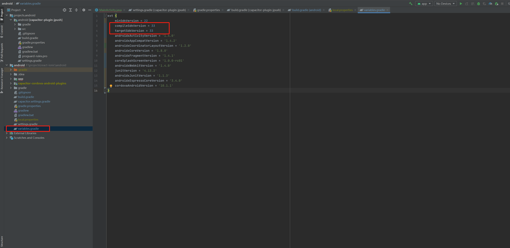
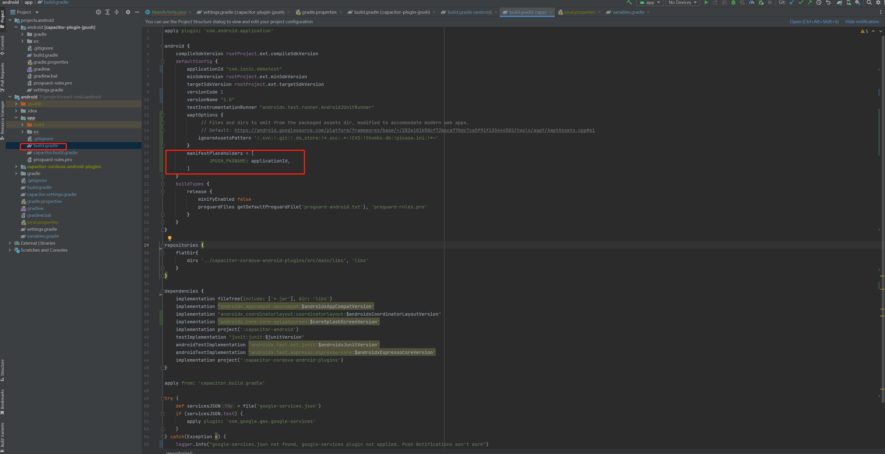

# capacitor-plugin-jpush
<p align="left">
  <!-- <a href="https://img.shields.io/badge/support-Android-516BEB?logo=android&logoColor=white&style=plastic">
    
  </a> -->
  <a href="https://img.shields.io/badge/support-IOS-516BEB?logo=ios&logoColor=white&style=plastic">
    
  </a>
   <a href="https://img.shields.io/badge/support-Android-516BEB?logo=android&logoColor=white&style=plastic">
    
  </a>
  <a href="https://www.npmjs.com/package/capacitor-plugin-jpush">
    
  </a>
  <a href="https://www.npmjs.com/package/capacitor-plugin-jpush">
    
  </a>
</p>

[English](./Zh-CN.md)

一款基于 `Capacitor 4.0+` 的极光推送插件，如果有使用上的问题，欢迎提 `issue`，我会尽力解决，也欢迎原生开发的大神贡献你的代码，如果这个插件帮助到了你，请留下你的 `star`，万分感谢，

## 安装

```bash
npm install capacitor-plugin-jpush
npx cap sync
```

## 使用

在 `capacitor.config.ts` 配置你的极光推送 `Appkey` 等相关信息, 并且确保你的应用包名和极光后台设置的一致:

```ts
/// <reference types="capacitor-plugin-jpush" />

import { CapacitorConfig } from '@capacitor/cli';
const config: CapacitorConfig = {
  plugins: {
    JPush: {
      // your application appKey on JPush
      appKey: '',
      channel: '',
    },
  },
};

export default config;
```

或者在 `capacitor.config.json` 中配置:

```json
{
  "plugins": {
    "JPush": {
      "appKey": "",
      "channel": ""
    }
  }
}
```

### IOS

在 iOS 上，您必须启用推送通知功能。 详见 [Setting Capabilities](https://capacitorjs.com/docs/v4/ios/configuration#setting-capabilities) 文档如何启用推送功能.

在打开了推送通知功能之后, 添加以下代码到你应用的 `AppDelegate.swift` 文件:

```swift
func application(_ application: UIApplication, didRegisterForRemoteNotificationsWithDeviceToken deviceToken: Data) {
  NotificationCenter.default.post(name: .capacitorDidRegisterForRemoteNotifications, object: deviceToken)
}
func application(_ application: UIApplication, didFailToRegisterForRemoteNotificationsWithError error: Error) {
  NotificationCenter.default.post(name: .capacitorDidFailToRegisterForRemoteNotifications, object: error)
}

// add the following code to applicationDidBecomeActive function
NotificationCenter.default.post(name: Notification.Name(rawValue: "didBecomeActiveNotification"), object: nil)
```
然后找到极光推送的依赖包文件, 也就是 `JPUSHService.h`，点击此文件，在编辑器右边窗口找到 `Target MemberShip`，将 `CapacitorPluginJPush` 勾选中，并将它的值设置为 `Public` 如下图所示（如果没有找到该依赖文件，请在你的前端项目先运行命令 `npx cap sync ios`，如果是 `Ionic` 项目，则是运行 `ionic cap sync ios`）:


### Android
Android 13 之后系统必须要有推送通知权限才可以收到推送消息，所以你可以通过 `checkPermissions()` 方法来检查你的应用是否开启了通知权限，如果没有，则可以通过 `requestPermissions()` 来启用通知权限，如果用户拒绝了，可以通过调用 `openNotificationSetting()` 方法来打开通知权限设置页面， 

在 Android 12 及更老的设备，系统默认就是启用了推送通知权限。

在你安卓应用下找到 `variables.gradle` 文件，将 `compileSdkVersion` 和 `targetSdkVersion` 值设置为 `33` ，如果已经是 `33` 可以忽略此步骤:



将以下代码添加到你应用 `app` 文件夹下的 `build.gradle`:
```bash
manifestPlaceholders = [
  JPUSH_PKGNAME: applicationId,
]
```


> Currently does not support the manufacturer channel push

## 代码示例

```ts
import { JPush } from 'capacitor-plugin-jpush';

// set alias
await JPush.setAlias({
  alias: 'alias',
});

// getRegistrationID
const { registrationId } = await JPush.getRegistrationID();
console.log(registrationId);

// addListener events
const receivedEvent = await JPush.addListener('notificationReceived', data => {
  console.log('notificationReceived------>', data);
});
receivedEvent.remove();

const openedEvent = await JPush.addListener('notificationOpened', data => {
  console.log('notificationOpened------>', data);
});
openedEvent.remove();
```

## API

<docgen-index>

* [`setDebugMode(...)`](#setdebugmode)
* [`setAlias(...)`](#setalias)
* [`deleteAlias(...)`](#deletealias)
* [`addTags(...)`](#addtags)
* [`deleteTags(...)`](#deletetags)
* [`cleanTags()`](#cleantags)
* [`setBadgeNumber(...)`](#setbadgenumber)
* [`removeListeners()`](#removelisteners)
* [`getRegistrationID()`](#getregistrationid)
* [`checkPermissions()`](#checkpermissions)
* [`requestPermissions()`](#requestpermissions)
* [`openNotificationSetting()`](#opennotificationsetting)
* [`addListener('notificationReceived', ...)`](#addlistenernotificationreceived)
* [`addListener('notificationOpened', ...)`](#addlistenernotificationopened)
* [Interfaces](#interfaces)
* [Type Aliases](#type-aliases)

</docgen-index>

<docgen-api>
<!--Update the source file JSDoc comments and rerun docgen to update the docs below-->

### setDebugMode(...)

```typescript
setDebugMode(isDebug: boolean) => Promise<void>
```

enable JPush debug log

| Param         | Type                 |
| ------------- | -------------------- |
| **`isDebug`** | <code>boolean</code> |

--------------------


### setAlias(...)

```typescript
setAlias(options: AliasOptions) => Promise<void>
```

set alias for JPush

| Param         | Type                                                  |
| ------------- | ----------------------------------------------------- |
| **`options`** | <code><a href="#aliasoptions">AliasOptions</a></code> |

--------------------


### deleteAlias(...)

```typescript
deleteAlias(options: DeleteAlias) => Promise<void>
```

| Param         | Type                                                |
| ------------- | --------------------------------------------------- |
| **`options`** | <code><a href="#deletealias">DeleteAlias</a></code> |

--------------------


### addTags(...)

```typescript
addTags(options: SetTagsOptions) => Promise<void>
```

| Param         | Type                                                      |
| ------------- | --------------------------------------------------------- |
| **`options`** | <code><a href="#settagsoptions">SetTagsOptions</a></code> |

--------------------


### deleteTags(...)

```typescript
deleteTags(options: SetTagsOptions) => Promise<void>
```

| Param         | Type                                                      |
| ------------- | --------------------------------------------------------- |
| **`options`** | <code><a href="#settagsoptions">SetTagsOptions</a></code> |

--------------------


### cleanTags()

```typescript
cleanTags() => Promise<void>
```

--------------------


### setBadgeNumber(...)

```typescript
setBadgeNumber(options?: SetBadgeNumberOptions | undefined) => Promise<void>
```

| Param         | Type                                                                    |
| ------------- | ----------------------------------------------------------------------- |
| **`options`** | <code><a href="#setbadgenumberoptions">SetBadgeNumberOptions</a></code> |

--------------------


### removeListeners()

```typescript
removeListeners() => Promise<void>
```

--------------------


### getRegistrationID()

```typescript
getRegistrationID() => Promise<{ registrationId: string; }>
```

**Returns:** <code>Promise&lt;{ registrationId: string; }&gt;</code>

--------------------


### checkPermissions()

```typescript
checkPermissions() => Promise<PermissionStatus>
```

**Returns:** <code>Promise&lt;<a href="#permissionstatus">PermissionStatus</a>&gt;</code>

--------------------


### requestPermissions()

```typescript
requestPermissions() => Promise<PermissionStatus>
```

**Returns:** <code>Promise&lt;<a href="#permissionstatus">PermissionStatus</a>&gt;</code>

--------------------


### openNotificationSetting()

```typescript
openNotificationSetting() => Promise<void>
```

now only on Android

--------------------


### addListener('notificationReceived', ...)

```typescript
addListener(eventName: "notificationReceived", listenerFunc: (notificationData: ReceiveNotificationData) => void) => Promise<PluginListenerHandle> & PluginListenerHandle
```

| Param              | Type                                                                                                       |
| ------------------ | ---------------------------------------------------------------------------------------------------------- |
| **`eventName`**    | <code>'notificationReceived'</code>                                                                        |
| **`listenerFunc`** | <code>(notificationData: <a href="#receivenotificationdata">ReceiveNotificationData</a>) =&gt; void</code> |

**Returns:** <code>Promise&lt;<a href="#pluginlistenerhandle">PluginListenerHandle</a>&gt; & <a href="#pluginlistenerhandle">PluginListenerHandle</a></code>

--------------------


### addListener('notificationOpened', ...)

```typescript
addListener(eventName: "notificationOpened", listenerFunc: (notificationData: ReceiveNotificationData) => void) => Promise<PluginListenerHandle> & PluginListenerHandle
```

| Param              | Type                                                                                                       |
| ------------------ | ---------------------------------------------------------------------------------------------------------- |
| **`eventName`**    | <code>'notificationOpened'</code>                                                                          |
| **`listenerFunc`** | <code>(notificationData: <a href="#receivenotificationdata">ReceiveNotificationData</a>) =&gt; void</code> |

**Returns:** <code>Promise&lt;<a href="#pluginlistenerhandle">PluginListenerHandle</a>&gt; & <a href="#pluginlistenerhandle">PluginListenerHandle</a></code>

--------------------


### Interfaces


#### AliasOptions

| Prop           | Type                |
| -------------- | ------------------- |
| **`alias`**    | <code>string</code> |
| **`sequence`** | <code>number</code> |


#### DeleteAlias

| Prop           | Type                |
| -------------- | ------------------- |
| **`sequence`** | <code>number</code> |


#### SetTagsOptions

| Prop       | Type                  |
| ---------- | --------------------- |
| **`tags`** | <code>string[]</code> |


#### SetBadgeNumberOptions

| Prop        | Type                |
| ----------- | ------------------- |
| **`badge`** | <code>number</code> |


#### PermissionStatus

| Prop                | Type                                                        |
| ------------------- | ----------------------------------------------------------- |
| **`notifications`** | <code><a href="#permissionstate">PermissionState</a></code> |


#### PluginListenerHandle

| Prop         | Type                                      |
| ------------ | ----------------------------------------- |
| **`remove`** | <code>() =&gt; Promise&lt;void&gt;</code> |


#### ReceiveNotificationData

| Prop           | Type                                                                                                                                  |
| -------------- | ------------------------------------------------------------------------------------------------------------------------------------- |
| **`title`**    | <code>string</code>                                                                                                                   |
| **`content`**  | <code>string</code>                                                                                                                   |
| **`subTitle`** | <code>string</code>                                                                                                                   |
| **`rawData`**  | <code>{ [x: string]: any; aps: { alert: { body: string; subTitle: string; title: string; }; badge: number; sound: string; }; }</code> |


### Type Aliases


#### PermissionState

<code>'prompt' | 'prompt-with-rationale' | 'granted' | 'denied'</code>

</docgen-api>
